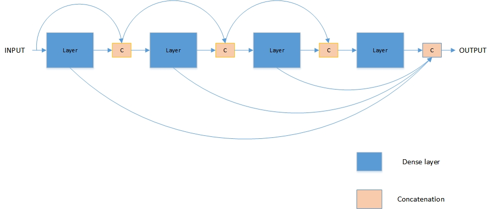

# Deeper Monocular Depth Prediction via Fully Convolutional DenseNets

## Abstarct
abstract

## 1.Introduction
单目图像深度估计是计算机视觉和图像处理领域最基本的问题之一，同时这也是一个非常具有挑战性的工作，也是目前视觉方面一个非常活跃的领域。传统方法解决这个问题最成功的例子之一就是Structure-from-Motion(SfM)[23],它通过相邻两帧之间的相机运动来得到深度信息。除了运动信息之外，亮度信息[24]也被用来得到深度信息。

在缺少了上述的条件的情况下，从一张色彩图片中恢复深度信息是一个非常困难的工作，这是因为它ill-posed问题的本质。即使对我们的大脑来说，从色彩图片中得到深度信息也是一件非常困难的事，我们通常只能猜测到非常宽泛的距离，这也是在我们有一定的先验知识下面。单目图像深度估计不仅仅帮助我们能在没有深度传感器的条件下获得深度信息，同时，获得精确的深度信息后，它通常也能帮助其他的视觉问题比如语义分割[4, 5], 平面法线估计(surfact normal)[5], 帧间运动[20, 15]等等。

在最近的几年里面，基于卷积网络的（Convolutional Neural Networks）state-of-the-art的单目图像深度估计方法逐渐成为主流[3, 4, 5, 6, 7, 8, 14],CNNs的方法经常结合条件随机场(CRFs Conditional Random Fields)作为后处理(Post-precessing)方法[6],或者通过随机森林(Random Forset)[18],这些方法都非常的复杂，需要大量的参数和数据驱动。与此同时，这些卷积神经网络CNNs的方法在准确性上有非常的提升在标准的数据集上，是目前最好的方法。

最近，一个新的卷积神经网络结构--DenseNet[1].DenseNet由Dense Block和Transition layer组成，Dense block是一种迭代拼接前面学习到的特征图(feature map)的一种结构，Transition layer通过池化操作完成。这个新的网络结构可以看成对一种对ResNets的延伸，ResNets直接通过加法的方式将前面学到的特征图传到后面的层，而DenseNet是将前面学习到的特征图直接拼接到后面的层，实现了特征的复用。虽然这是一个小的改变，但是它带来了以下几个好处：(1)节省参数，相比于ResNets，DenseNet在相同层数下节省了更多的参数。(2)暗含的高层次的信息，底层的特征通过拼接直接传到后面。(3)特征复用，所有的层都可以感受到前面所有的层学习到特征。这些属性使得DenseNets适合做深度估计，这是因为跳连接(skip connecetion)的结构和结合的多个尺度的特征信息的设计。

在这篇论文中，我们扩展了通过一种通过Dense net进行语义分割的网络结构[11]，因为深度估计和语义分割的相似性，我们只修改了像素上升路径中(Upsampling path)的结构，通过结合不同和分辨率下的输出，我们可以的到更好的输出。和[11]相似，在上升路径中，我们只上采样上一个dense Block学习到的特征图，通过这样的网络结构，我们包含了每一个分辨率下的输出。同时，为了保留开始几个dense block的特性图，我们采用跳连接的方式将学习的特征图传递的后面。跟随[25]的网络结构，我们在不同的分辨率下得到进行不同的输出估计，然后通过上采样的方式，我们将他们不同分辨率的深度估计统一到网络输入的分辨率，在训练的时候通过不同分辨率的深度估计计算多个损失函数累加到一起。具体的网路结构如图1所示。我们在两个标准的benchmark数据集，Make3D[21]和NYUV2[22]上对我们的方法进行了测试，证明了我们的方法的能提高单目图像深度估计效果。

4 总结自己的工作， 
这篇论文的贡献主要贡献在以下几个方面：
* 我们扩展了[11]全卷积dense net进行语义分割的结构来完成单目图深度估计。
* 我们扩展了[11]提出的上采样的结构，通过结合多个分辨率下的loss函数，在一定程度上解决了过去深度估计上存在的过于平滑的现象。
* 我们证明了这样的网络结果在没有预训练参数和其他后续处理的情况下，在标准数据集上的结果超过其他的state-of-the-art的方法。

## 2.Related Work

从图片中得到深度数据最开始通过立体视觉完成[26],通过输入图片对来完成深度估计。在单目图片深度估计的领域，最常见的方法是通过Sfm[20](Structure-from-motion)完成，或者通过shape-from-defocus[27],在缺少上述条件的情况下，单目的深度估计也有许多的研究，下面的相关工作部分，和我们的方法相似，主要针对单目图像深度估计的方法。

在卷积神经网络成为解决单目图像深度估计的主流方法之前，经典的方法解决这个问题主要通过人工设计(hand-crafted)的特征，然后通过概率图模型的方法来解决这个问题。最开始的工作是Saxena et al. [10]使用全局和局部特征来进行深度估计，通过MRF和线性回归(linear regression)的方法进行深度估计，随后他们将他们的系统扩展到Make3D[21]系统来完成3D图像的生成。然后他们的方法需要图片的水平对齐，这也就限制了他们系统的应用。

最近几年来，在单目图像深度估计领域，卷积神经网络(CNNs)的方法引领了这个领域的前进。因为这个方法和语义分割问题的相似性，大部分的网络结够建立在(ImageNet Large scale Visual Recognition Challenge ILSVRC)[28],而且网络权重的初始值来自于预训练好的网络，比如AlexNet[29]或者VGG[13]。Eigen et al. [3]是最开始使用了AlexNet为基础的网络结构来进行深度估计，他使用了两个尺度(scale)的网络结构预测深度图，一个来捕捉全局信息，一个来捕捉局部信息，捕捉全局信息的部分是基于AlexNet。之后，他们扩展了网络结构[5]扩展到了3个尺度（scale）,他们得到了更好的结果，其中的原因之一是他们使用了更深的网络结构VggNet,并且他们增加了scale的个数。同样的，在ImageNet上得到更好结果的ResNet也被用来进行深度估计，Laina et al. [8]，使用了基于resnet的结构来进行深度估计，虽然在增大分辨率阶段他们使用了Up-Projection Block来恢复输入图像的分辨率，但是他们的成功还是因为在ImageNet上预训练的50层的Resnet结构。除了还是使用卷积神经网络之外，随机森林的方法也被用来进行深度图的估计[18].

另外一个方向是通过图模型和卷积神经网络结合的方法来提高预测的深度图的精度[4, 6]，Wang et al.[6]和 Liu et al.[4]使用分层的CRFS来增强卷积神经网络的预测图，通过图模型的方法，他们得到了更好的结果，然而这些概率图模型的方法也增加的问题的复杂性。

我们的方法同样使用了一个卷积神经网络结构来进行深度估计，与前面的方法不同的是，它并没有使用全连接层来恢复分辨率[3, 5],减少了的大量的参数，和[3, 5, 8]不同，全卷积神经网络结构的使用使我们不需要使用上采样的方法来扩大预测的深度图的分辨率，而且我们的网络有可以接受任何分辨率的输入。同时反卷积[12]的使用也可以恢复更多了细节信息，在一定程度上解决了过于平滑的问题.

## 3.Approach

在这节里面,我们描述进行单目图像深度估计的模型。首先我们复述一下DenseNet的结构，然后引入upsampling path,并说明用它的原因和描述我们在深度估计方面的改用及其好处。最后我们详细描述整个网络的结构。

### 3.1 The DenseNets Architecture

设$x_l$为滴$l^{th}$的输出，在标准的卷积神经网络结构中，$x_l$由一个前面层的输出$x_{l-1}$和一个非线性准换$H_l$组成
$$
x_l = H_l(x_{l-1})
$$
H一般定义为一个卷积运算，一个非线性整流函数(ReLU rectifier no-linearity),通常后面还会有一个dropout[30].

为了训练更深的网络，ResNets[2]引入了跳连接的方法直接把输入直接映射(identity mapping)到后面的层，输出层的$x_l$变为：
$$
x_l = H_l(x_{l-1}) + x_{l-1}
$$
通过这样的操作，允许的梯度向后传播，避免在深层次的梯度消失现象，从而可以训练更深的网络。H 通过被定义为一个重复二或三次的块，这个块由Batch Normalization(BN)[31],ReLU,和一个卷积组成。

与ResNets将低层的特征图累加到后面的输出的结构不同，DenseNets[1]使用了拼接的方法将将一个Dense block中所有前面层的特征图拼接在一起，然后一起向后传播，得到后面层的特诊图。所以$l^{th}$层的输出可以被定义为
$$
x_l = H_l([x_{l-1}, x_{l-2}, ..., x_0])
$$
在这里[...]表示拼接操作。H 被定义为连续的BN, ReLU, 卷积和DropOut.这样的连接方式使得特征可以复用，并且死的所有的层都可以接受到supervision的信息。每个layer包含k个特征图(feature map),k表示增长速率。在DenseNets中，特征图是线性增长的，比如，在l层之后，输出$[x_{l-1}, x_{l-2}, ..., x_0]$就会包含l*k个特征图。

为了减小特征图的维度，我们引入Transition down模块。这个模块包含BN,ReLU和一个1 * 1的卷积，后面跟随一个2 * 2的池化操作。

在图二中展示了一个dense block结构，从一个来上层的transition down模块或者一个图片$x_0$ 作为输入，这个输入包含$m$个feature maps，第一个dense layer会产生$k$个特征图的输出，然后我们将得到的$k$个feature map 拼接在第一个输入中，得到的$[x_1, x_0]$，作为第二个dense layer的输入。重复这个操作n次，就会得到$n * k$的输出特征图。

### 3.2 Fully Convolutional DenseNets

几乎所有卷积神经网络都会通过一系列的卷积和池化操作来降低特征图的分辨率，在深度估计像素到像素的回归问题的中，如何从较低分辨率的特征图的中恢复到高像素的特征图一个非常重要的模块。Eigen et al [3]通过一个全连接层来恢复特征图的输出分辨率，然后由于全连接层会引入大量的参数，由于显存的限制，在他们的网络结构中，最后一层神经元的输出分辨率只有输出图像分辨率的1/4。最后通过插值的方法才能恢复到到输出图片的分辨率，但是全连接层的存在，限制了感受野的传播。

为了恢复从低像素的图片中还原出原始图片的分辨率，全卷积神经网络(FCN)被引入，Laina et al.[8]通过一系列卷积操作和反池化(up pooling)模块来恢复输入图片的分辨率，然后在他们得到的深度预测图也只有输入分辨率的一半。在我们网络结构中，反卷积[12]操作(transposed convolutions)被使用来恢复图片的分辨率。因为反卷积操作只引入少量的参数，所以我们得到的深度估计图的分辨率和原始输入图片相同。在FC-DenseNets中，通过一个transition up 模块来恢复图片的分辨率。这个模块包含了一个3*3，步长为2的反卷积操作。由于dense block中特征线性增长的特点，如果我们对所有学习到的特征图进行反卷积操作，那么会使用很多的现存。

因为显存的限制，FC-DenseNets只对前面一个dense block学到特征图进行上采样操作，最后一个dense block接受了前面所有层的特征图,为了对前面的dense block学到的特征图进行复用，我们将前面的dense block学到的特征通过跳连接方法拼接到相同像素的后层。这样的操作，避免dense block特征线性增长造成的特征图过多的情况，避免使用过多的现存。

### 3.3 Depth prediction Architecture

## 4.Experimental Results

在这一章中，我们完成的分析我们的这个模型。我们在两个标准的数据集NYU Depth v2和Make3D上测试我们的模型，并和其他的state-of-the-art的方式进行比较。

### 4.1. Experimental Setup

我们使用开源的深度学习框架PyTorch[]来实施我们的网络,，并且在一个拥有11GB的显存的GTX 1080Ti上训练我们的网络，所有的权重卷积层和反卷积层使用kaiming-normal[]的初始化方法进行初始化。

训练时，网络的输入是RGB图片，预测对应的深度图。我们使用和Eigen et al.[]相同的方式来进行数据增强。

* 尺度:输入和目标同时进行尺度为$s\in[1, 1.5]$,对应的深度数据除以s
* 旋转:输入图片和目标同时旋转$r\in[-5, 5]$度
* 颜色:输入图片乘以一个随机的值$c\in[0.8, 1.2]$
* 翻转:输入图片和目标同时进行概率为0.5的水平翻转

为了进行量化的比较，跟随以前的工作[]，我们使用相同的量化标准来判断我们的方法。

* Threshold: % of $y_i$ s.t. $max(\frac{y_i}{y_i^*},\frac{y_i^*}{y_i}) = \delta < thr$
* Abs Relative difference: $\frac{1}{|T|} \sum_{y\in T} |y - y^*|/y^*$
* Squared Relative difference:$\frac{1}{|T|}  \sum_{y\in T} ||y - y^*||^2 /y^*$ 
* RMSE(linear):$\sqrt{\frac{1}{|T|}\sum_{y\in T} ||y - y^*||^2}$
* RMSE(log):$\sqrt{\frac{1}{|T|}\sum_{y\in T} ||\log y - \log y^*||^2}$

### 4.2. NYU Depth Dataset

我们首先在最大的RGB-D数据集上评价我们的模型--NYU Depth V2[],初始的数据集包含464个场景，通过一个Microsoft Kinect深度摄像机获得，官方的数据集划分是249个场景训练，215个作为测试。在训练的时候，我们只需要这个数据集很少的一部分。通过官方提供的工具，我们的对数据集进行同步处理，然后等间距采样得到10K个不重复的训练对。在完成了离线的数据增强之后，我们大概得到44K个RGB-D训练对。在这里我们需要指出我们数据集远远小于其他方法在进行训练的时候的数据集。在[3, 5]中，使用了120个不重复的训练对，同样的在[6]中，采样了800k个训练对，即使在[8]中，他们也使用了95k个训练对。在处理数据的时候，我们先将所有的训练数据对resize到224*224分辨率，然后对它们做离线的数据增强。作为网络的数据。最后我们大小为8的batch训练大概20轮。开始的学习速率是$10_{-2}$,然后当我们观察到loss函数停滞的时候下降学习速率，大概6-8轮下降一次

### 4.3. Make3d Dataset

然后，我们在户外数据集Make3D[]上评估我们的方法。这个数据集包含400个训练和134个训练数据集，通过普通的3D扫描仪获得的。因为这个数据集的年代久远，所以深度数据集是像素只有305 * 55,然而初始的图片的大小为1704 * 2272,我们把图片和深度数据都resize到256 * 192,我们使用的数据增强的方法得到12k的数据对进行训练，我们使用l1的loss函数，在batch size为8的情况下，训练40轮(epochs).学习速率恒定为0.01.Momentum是0.9.因为这个数据集的收集时间太久了，数据集的质量并不太好。训练的时候我们的mask掉距离超过70m的像素点。

在测试的时候，我们也把测试数据集resize到256 * 192来进行测试，我们在表三中记录和其他的方法比较的结果。在测试的时候我们只计算小于70m的像素点。[32]对天空的像素点进行了预处理，并在训练的时候将它们排除了。Laina et la.[8]权重在ImageNet上进行了预训练。我们的数据集在通过$l_1$loss函数进行训练，达到了几乎的相同的结果。我们同时也对[8]提出的berHu loss函数进行了测试，我们发现在我们的模型中，这个loss函数并没有帮助。部分的预测图的结果如图所示。

## 5.Conclusion

## 6.References